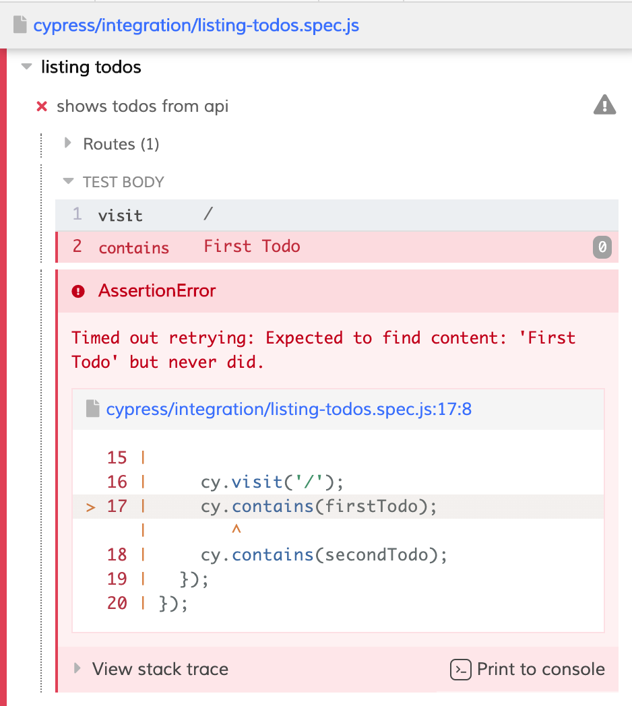

This post is the first part of the test-driven development with React series. We will be using CRA (Create React App) as application template, Jest, React Testing Library and Cypress as our testing tools in this series. In this part, we will set up our React application, linting and test environment then we will take the first step to develop our first feature with ```Test Driven Development``` for our "TODO" application. Let's get started shall we?

Before we begin I would like to give some information about the specific TDD approach that we will be practicing in this series.

## Outside-In TDD
TLDR; First, we will use E2E tests to  define the feature we want. Then we will create neccesary components/structures to start writing unit tests. Then we will start to implement component/application logic to make our unit tests green. After all test cases are green we will refactor our code if needed and step back to the _outside_ level. Eventually we will have our feature production ready by following this _red-green-refactor_ cycle with _Outside-in TDD_ approach.


## Creating the App
First we create our application with following npx command. If you have any trouble running it please check [CRA documentation](https://github.com/facebook/create-react-app#creating-an-app).
```shell
$ npx create-react-app todo-app
```
It will start the installation and when it completes we will have our application ready to roll.

After completion please open package.json file to see what scripts we have available:
- ```start``` to run application, obviously
- ```build``` to create a release build of application
- ```test``` to run unit tests (currently we have only App.test.js)
- ```eject``` to custom setup, it moves every configuration and dependencies into project (leave it for now)

Go ahead and run the application with start command; you will see spinning React logo on your browser.

## Setting Up Linting/Formatting
I would be very happy (probably you will too) if we add ESLint and formatting configurations before writing a single line of code because it will help us to be consistent. Luckily we already have ESLint installed in CRA app we just need to add some more configuration.

```shell
npx eslint --init
```

What this will allow us to configure ESLint from CLI and create ```.eslintrc``` file automatically. So if you run this command you will be prompted with some questions and BOOM! Now you have a config file.


Still, we need to add plugins of Cypress, Jest and Prettier for ESLint, to do that please install the following packages.

```shell
$ yarn add --dev eslint-config-prettier \
                 eslint-plugin-cypress \
                 eslint-plugin-jest \
                 eslint-plugin-prettier \
                 prettier
```

Now, we need to tweak configuration files for Cypress, Jest and Prettier plugins.

```js
module.exports = {
  env: {
    browser: true,
    es2020: true,
    'cypress/globals': true,
    'jest/globals': true,
  },
  extends: [
    'plugin:react/recommended',
    'airbnb',
    'prettier',
    'plugin:jest/recommended',
    'plugin:cypress/recommended',
  ],
  parserOptions: {
    ecmaFeatures: {
      jsx: true,
    },
    ecmaVersion: 11,
    sourceType: 'module',
  },
  settings: {
    react: {
      version: 'detect',
    },
  },
  plugins: ['react', 'prettier', 'jest', 'cypress'],
  rules: {
    'prettier/prettier': 'warn',
  },
};
```
With this configuration setup we have:
- Set up linting with additional airbnb, Jest, Cypress and Prettier rules.
- Configure ESLint to aware of globals provided by Cypress and Jest

And last, Prettier configuration; create ```.prettierrc.js``` file and paste the following content. I haven't added too much config for prettier but you can check [the documentation](https://prettier.io/docs/en/options.html) and adjust it more.

```js
module.exports = {
  "tabWidth": 2,
  "useTabs": false,
  "arrowParens": "avoid",
  "bracketSpacing": true,
  "singleQuote": true,
  "trailingComma": "all"
}
```
## Setting up E2E Testing - Cypress
Now we have configured linting/formatting it's time to add our E2E testing tool - Cypress.

```shell
yarn add --dev cypress
```
After installing, add a script to ```package.json``` file. 

```diff
{
  "start": "react-scripts start",
  "build": "react-scripts build",
  "test": "react-scripts test",
+ "cypress": "cypress open",  
  "eject": "react-scripts eject"
}
```
If we run ```yarn cypress``` a Cypress window will open and tell you it has run succesfully and created bunch of example tests. Now you can click any of these to see how Cypress works; if you do a new browser window will open and run the selected spec.

Time to tweak some configuration. In your workspace there is a new file called ```cypress.json``` which just generated by Cypress and used for its configuration. Open it and add URL of our application. 

```json
{
 "baseUrl": "http://localhost:3000"
}
```
From now on all relative URLs will be interpreted to the root of our app. If you like you could delete ```cypress/integrations/examples``` directory since we don't need those then create a file ```cypress/integration/smoke.spec.js``` and add our first E2E test.

```js
describe('Smoke Test', () => {
  it('can view the default react page', () => {
    cy.visit('/');
    cy.contains('Learn React');
  });
});
```

With this test our only intention is to verify that our application is accessible and working properly with Cypress tests. If you go back to Cypress window (re-run ```yarn cypress``` if you closed it) and you should see updated spec list with only one test. Click it and you will see our React application beside successful test runs.


## Cleanup

Before we get to developing listing todos feature, let's clean up the project a little bit. Delete the following files

- App.css
- App.test.js
- logo.svg
- serviceWorker.js
- smoke.spec.js

Replace content of App.js
```js
import React from 'react';

const App = () => {
  return <div>Hello World</div>;
}

export default App;
```
index.js
```diff
  import React from 'react';
  import ReactDOM from 'react-dom';
- import './index.css';
  import App from './App';
- import * as serviceWorker from './serviceWorker';

  ReactDOM.render(
    <React.StrictMode>
      <App />
    </React.StrictMode>,
    document.getElementById('root')
  );

- // If you want your app to work offline and load faster, you can change
- // unregister() to register() below. Note this comes with some pitfalls.
- // Learn more about service workers: https://bit.ly/CRA-PWA
- serviceWorker.unregister();
```

## Listing Todos
Let's start by displaying todos as a list on screen. That would be very cool if we had a backend API for that. In fact we do have an API, we will use [mockapi.io](https://mockapi.io/) and I've already configured a project so you don't need to do that. However if you like you could create your own project and use that one in the exercise.

We will use https://5f0c1de19d1e150016b37d04.mockapi.io/todos endpoint to fetch availlable todos. So let's create a component and implement it to display data from API, right?

A big no. Since we are practicing test-driven development we must allow tests to drive our code. We will start from outside, in our case it's writing E2E test first and watching it fail.

Create ```listing-todos.spec.js``` with following content in ```cypress/integration``` directory.

```js
describe('listing todos', () => {
  it('shows todos from api', () => {
    const firstTodo = 'First Todo';
    const secondTodo = 'Second Todo';
    cy.server({ force404: true });

    cy.route({
      method: 'GET',
      url: 'https://5f0c1de19d1e150016b37d04.mockapi.io/todos',
      response: [
        { id: 1, name: firstTodo },
        { id: 2, name: secondTodo },
      ],
    });

    cy.visit('/');
    cy.contains(firstTodo);
    cy.contains(secondTodo);
  });
});
```

Here is what we have done:
- Fist we created todo variables which we will use to mock GET response and later check if they are in document with Cypress.
- Then we setup Cypress server with ```{ force404: true }``` option. With that option Cypress will return ```404 Not Found``` status for not stubbed requests with ```cy.route```. [See more](https://docs.cypress.io/api/commands/server.html#Send-404s-on-unmatched-requests) about it.
- Then we call ```cy.route``` to stub GET request that we gonna call and whenever we send request we will get specified response.
- Call Cypress to navigate root path of the application. Then we expect to see todo values in document with ```cy.contains```.

Go ahead, run ```yarn cypress``` and click ```listing-todos.spec.js``` test and watch it fail. It has failed because we told Cypress to expect ```First Todo``` in page content but it couldn't find.



Now it's time to write some code to make it green. But before we do let's think about the structure of code a moment. We know that we need to display some todo items on screen, so we would need:
- Component to display todo items
- An API client to fetch data
- A structure to store and manage fetched data

Since we practice outside-in testing, we should first build outside which corresponds to interface components in this example. Currently we only have ```<App/>``` component; we could write all displaying logic in ```<App/>``` component but it's better if we do not bloat ```<App/>``` component with that logic and create a seperate component.

```diff
  import React from 'react';
+ import { TodoContainer } from './containers';


  const App = () => {
    return (
      <div>
-     Hello World!
+     <TodoContainer />
      </div>
    );
  };
```

Then create ```containers``` directory then inside create a ```TodoContainer.js``` component.

```js
import React from 'react'

const TodoContainer = () => {
  return (
    <div>
      Todos
    </div>
  )
}

export default TodoContainer;
```

You might have realized that we have imported TodoContainer like this ```{ TodoContainer }``` in ```<App/>``` component. It's because we will use Barrel export. But what is barrel export is?

> A barrel is a way to rollup exports from several modules into a single convenient module. The barrel itself is a module file that re-exports selected exports of other modules.
> 
> Source: [Barasat Gitbook](https://basarat.gitbook.io/typescript/main-1/barrel)

I am using VS Code as text editor and I have an awesome extension recommendation for this job, [Auto Barrel](https://marketplace.visualstudio.com/items?itemName=mikehanson.auto-barrel). It allows you to create barrel files automatically with one-click.

If you want to do it manually create an ```index.js``` file inside ```containers``` folder and paste following content.

```js
export { default as TodoContainer } from './TodoContainer';
```

Even though we did bunch of work if we re-run E2E test we will see that we are not even close to passing the test. Since we are developing a todo application we will also have adding todo feature and that's different responsibility from listing. Thus it might be perfect time to create ```<TodoList/>``` component.

```diff
  import React from 'react'
+ import { TodoList } from '../components';

  const TodoContainer = () => {
    return (
      <div>
-       Todos
+       <TodoList/>
      </div>
    )
  }
  
  export default TodoContainer
```

Create a ```components``` folder and inside create ```TodoList.js``` component.

```js
import React from 'react'

const TodoList = () => {
  return <div>TodoList</div>;
}

export default TodoList;
```

## Writing a Unit Test
Now that we have the components that we need for now, it's time to step "inside"; to the unit test level. We have already specified feature behavior in "outside" level with E2E test and now, we will narrow down specifying behavior of component with unit tests.

To start with unit tests, let's create a ```__tests__``` folder inside ```src``` directory, then inside create a ```TodoList.spec.js```.

```js
describe('Todo List', () => {
  it.todo('should load todos on first render');
  it.todo('should display todo items');
});
```
Go ahead and run ```yarn test``` and you will see following:


Note that we have described tests as todo and they are highlighted with purple color on the console. This is because we have used ```it.todo``` method of Jest. I really like to describe tests like this instead of using an empty callback function. We don't usually write our tests all together but if we do, we could prepare a "todo list" for tests with this approach.

As our first test tells us we expect to fetch todos on render so we could expect component to have a ```loadTodos``` function. For now we do not care where this function comes from, it might come from connected Redux component or from the parent. This is just implementation detail and we don't need to think about it while writing our test.
Yet we need to mock this function in our component so let's do it with Jest.

```js
describe('Todo List', () => {
  it('should load todos on first render', () => {
    const loadTodos = jest.fn().mockName('loadTodos');
  });
});
```

Then we need to render the component. We use ```render``` function of React Testing Library in order to do that. Also as prop we pass mocked ```loadTodos``` function. we add an expectation to check if mocked function was called. If mocked function was called that means that our component loads todos.

```diff
+  import React from 'react';
+  import { render } from '@testing-library/react';
+  import { TodoList } from '../components';
  
  describe('Todo List', () => {
    it('should load todos on first render', () => {
      const loadTodos = jest.fn().mockName('loadTodos');
+     render(<TodoList loadTodos={loadTodos} />);
+     expect(loadTodos).toHaveBeenCalled();
    });
    it.todo('should display todo items');
  });
```

Re-run tests and watch it fail. 


What test tells us is that it expected to function to have been called at least one time but it didn't. That's normal because we haven't did anyting in our component about ```loadTodos``` function. Let's make it green.

```diff
  import React, { useEffect } from 'react';
  
  const TodoList = ({ loadTodos }) => {
+   useEffect(() => {
+     loadTodos();
+   }, []);
    return <div>TodoList</div>;
  };
  
  export default TodoList;
```

Save the file and you will see that we've passed the unit test! Now, let's write a test for the second behavior: Displaying todo items. Add following ```it()``` block inside the ```describe()```.

```js
it('should display todo items', () => {
  const noop = () => {};
  const todos = [
    { id: 1, name: 'First Todo' },
    { id: 2, name: 'Second Todo' },
  ];
  const { queryByText } = render(<TodoList loadTodos={noop} todos={todos} />);

  expect(queryByText('First Todo')).not.toBe(null);
  expect(queryByText('Second Todo')).not.toBe(null);
});
```
Here is what we have just done:
* Since we aren't going to run any expectation for ```loadTodos``` we created ```noop``` function that does nothing.
* We define an array of ```todos```.
* We render the component and destructure the ```queryByText``` property which we will use in expectation.
    * ```queryByText``` will search all elements text node with given text. If it matches any node, it returns element; if it doesn't, it returns null. Here is [documentation](https://testing-library.com/docs/dom-testing-library/api-queries#bytext).
* Then we use ```queryByText``` function to check render result and we expect to have _not_ null as result to confirm we have our list.

Let's save file and run, it's failed as we expect.


We received _null_ which means that none of elements have text node with the "First Todo". Now, time to modify our component to pass the test.

```diff
- const TodoList = ({ loadTodos }) => {
+ const TodoList = ({ loadTodos, todos }) => {
    useEffect(() => {
      loadTodos();
    }, []);
-   return <div>TodoList</div>;
+   return (
+     <ul>
+       {todos.map(todo => (
+         <li key={todo.id}>{todo.name}</li>
+       ))}
+     </ul>
+   );
  };
```
We have added ```todos``` prop so we could list them with ```map()``` function. Let's save and watch our tests again.


Now we see that second test passed, but first one failed. It's because we didn't provide ```todos``` prop in first test. Let's fix that.

```diff
 it('should load todos on first render', () => {
   const loadTodos = jest.fn().mockName('loadTodos');
+  const todos = [];

-  render(<TodoList loadTodos={loadTodos} />);
+  render(<TodoList loadTodos={loadTodos} todos={todos} />);
   expect(loadTodos).toHaveBeenCalled();
 });
```

Successfully all tests are green! Now we now ```TodoList``` component has all behavior we need. In the TDD cycle, **when we get green light for the tests we should look for refactoring opportunities**; both in production and test code. We will clean up some duplication in our test code but since we don't have much production code we will leave it for now. 

In both of our tests, we use some todo mock data, a mocked function and rendered ```TodoList``` component. We could move this code into ```describe()``` scope and wrap it with ```beforeEach()``` function of Jest. After refactoring our tests should look like following:

```js
describe('Todo List', () => {
  let loadTodos;
  let context;
  const todos = [
    { id: 1, name: 'First Todo' },
    { id: 2, name: 'Second Todo' },
  ];
  beforeEach(() => {
    loadTodos = jest.fn().mockName('loadTodos');
    context = render(<TodoList loadTodos={loadTodos} todos={todos} />);
  });
  it('should load todos on first render', () => {
    expect(loadTodos).toHaveBeenCalled();
  });

  it('should display todo items', () => {
    const { queryByText } = context;

    expect(queryByText('First Todo')).not.toBe(null);
    expect(queryByText('Second Todo')).not.toBe(null);
  });
});
```

So what we have just done:
* Moved description of mock data and function into ```describe()``` scope. Also defined a new variable ```context```; which used to store result of ```render()```.
* Then in ```beforeEach()``` we assigned loadTodos and context. Whatever is inside ```beforeEach()``` will run before each test so even though we used the same variables for both tests, they will be isolated from each other.

Save the file and tests should pass. Now our tests are much cleaner and we can clearly see what we are aiming for in each test.

## Back to Outside Level
In unit test, we defined every behavior that we need for our component and got green light. Now it's time to step outside E2E tests and see what we need to do. Rerun ```yarn cypress``` and check the output.

```js
Cannot read property 'map' of undefined
```


Why did we get this error? Didn't we write the necessary logic in our component? Yes, we did but we never actually implement the logic to pass todos into our component. These are just implementation details, no matter what method we use to do that, our component will not care about the implementation. Of course, as long as the tests remain green. 

With unit tests we designed our components behavior and now we could use any implementation to pass this E2E error. We could use Redux, React Context API or something else for this, and in this post I will use Context API with useReducer hook with a similar approach to Redux.

In order to fix that let's start by creating Context API. Create ```contexts``` folder and within this create a ```TodoContext.js``` file and put the following content

```js
import React from 'react';

export const TodosInitialState = {
  todos: [],
};

export const TodoContext = React.createContext(TodosInitialState);
TodoContext.displayName = 'TodoContext';

const TodoProvider = ({ children }) => {
  const [state, dispatch] = useReducer(TodosReducer, TodosInitialState);
  const loadTodos = () => {};

  return (
    <TodoContext.Provider
      value={{
        ...state,
        loadTodos,
      }}
    >
      {children}
    </TodoContext.Provider>
  );
};

export default TodoProvider;

```
What we have done is:
- Created a TodoContext object with ```createContext()``` method of React.We used ```TodosInitialState``` as initial value which we will also use in reducer.
- Then we assigned it's ```displayName``` value with something meaningful. This will help us to find ```TodoContext``` in DevTools.
- We added ```useReducer``` hook with ```TodosReducer``` object. This will be used as our store that we provide into Context. Don't worry about reducer itself, we will create it in a minute.
- Added an empty ```loadTodos``` function.
- We created a small component that wraps child components with TodoContext. Note that we passed ```loadTodos``` function and state object as value to Context.

Now, add ```TodoProvider``` into ```<App>``` component.

```diff
 const App = () => {
   return (
     <div>
+      <TodoProvider>
         <TodoContainer />
+      </TodoProvider>
     </div>
   );
 };
```

Add ```useContext()``` hook with ```TodoContext``` parameter into ```<TodoList>```. This will allow us to access context from component. Think of it like ```connect()``` function of Redux.

```diff
 export const TodoContainer = () => {
+  const { todos, loadTodos } = useContext(TodoContext);
 
   return (
     <div>
       <h1>Todos</h1>
-      <TodoList />
+      <TodoList todos={todos} loadTodos={loadTodos} />
     </div>
   );
 };
```

Now to solve compile error, create ```reducers/TodosReducer.js``` and add following content:

```js
const TodosReducer = (state, action) => {
  return state;
};

export default TodosReducer;
```

After that if we rerun E2E tests again you would see that we don't get any application errors now, instead we get "First Todo" is never shown error again. However we made some progress, ```<TodoList/>``` component 
now calls ```loadTodos``` function, and lists received ```todos``` from provider. 

Now let's start defining ```TodosReducer``` behavior with unit test. Create ```reducers/__tests__/TodoReducer.spec.jsx``` and add following content:

```js
describe('TodosReducer', () => {
  describe('loadTodos action', () => {
    it.todo('should store the todos');
  })
});
```
Here we are expecting that TodosReducer will handle an action called  loadTodos and will store todos data as a result of that action.

- TIME TO CREATE BASIC REDUCER ✅
- RUN E2E test and see different error (First todo not in dom) ✅
- CREATE UNIT TEST FOR TodoReducer (loadTodos - Need to mock API)
- SHOW UNIT TEST ERROR
- IMPLEMENT LOAD TODOS ACTION AND REDUCER.
- UNIT TEST PASSED
- BACK TO E2E - FAILS WITH DIFFERENT ERROR
- IMPLEMENT API CLIENT
- FIRST FEATURE SHOULD BE DONE
-------------

Outline
- Step down to unit test ✅
- Create TodoList comp. Write tests for it with loadTodos method. ✅
- __USE it.todo to show creating tests as todo__ ✅

- Explain why we create HOC for TodoContainer
  - Write unit test for TodoProvider 
  - Create basic TodoContext (empty)
  - Create TodoProvider only to provide todos
  - Create TodoReducer (empty)
  - Rerun E2E tests and show error
  - Add empty loadTodos func.
  - Show E2E error (Todo not visible error)

- Implement actual logic and make tests green 
  - Implement component logic
  - Implement Context and store
  - Implement client API
- Refactor if needed
- __Might goood place to start Pt-2__
- Describe second feature: Adding Todos,
- Write E2E test that describes Adding Todo.
- Create minimal component (TodoCreateForm)
- Step down to unit tests and describe behavior
- Implement actual logic till making tests green.
- Conclusion & takeaways